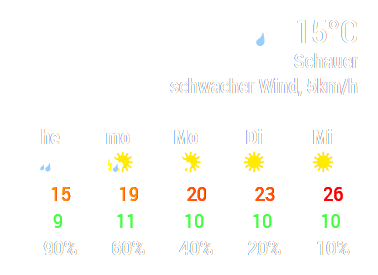

# MMM-WetterOnline

This is a module for [MagicMirror²](https://github.com/MichMich/MagicMirror/). It displays weather data for weather stations operated by [WetterOnline](https://www.wetteronline.de).



## Install the module

Go to modules folder
```
cd modules/
```

Clone this module from Github
```
git clone https://github.com/bogenpirat/MMM-WetterOnline.git
```

After adding this module to your config (see below) restart your MagicMirror.

## Update the module

Go to modules folder

```
cd modules/MMM-WetterOnline
```

Pull changes from Github

```
git pull
```

Pulling changes should always work. If not, try to reset your module with ``git reset --hard`` before pulling new changes.

## Using the module

To use this module, add the following configuration block to the modules array in the `config/config.js` file:
```js
var config = {
    modules: [
        {
            module: 'MMM-WetterOnline',
            position: "top_right",
            config: {
                // See below for configurable options
            }
        }
    ]
}
```

## Configuration options

All options are optional so the module works out of the box.

| Option                 | Description
|----------------------- |-----------
| `city`                 | Weather station string for data. This derives from the URL from wetteronline.de that displays your trend data. Ideally, you should go to [WetterOnline](https://www.wetteronline.de/), search for your city (or use geolocation) and then copy the relevant bit out of the resulting url, e.g. `reykjavik` from `https://www.wetteronline.de/wetter/reykjavik`<br><br>**Type:** `String`<br>**Default:** `new-york`
| `width`                | Width of the displayed module data. <br><br>**Type:** `HTML width attribute`<br>**Default:** `400px`
| `daysTrend`            | Amount of upcoming days to display in the weather trend. This goes up to 16, where the first is the current day, the second is tomorrow and so on.<br><br>**Type:** `Number`<br>**Default:** `4`
| `updateIntervalMins`   | Time to wait before refreshing weather data in minutes.<br><br>**Type:** `Number`<br>**Default:** `5`
| `userAgent`            | User-Agent to use for requests to the site. Mobile UAs will not work.<br><br>**Type:** `String`<br>**Default:** see [MMM-WetterOnline.js](MMM-WetterOnline.js)

## Developer notes

This was written by a node/MM first timer. Expect ugly design choices, terrible use of JavaScript/CSS and feel free to create pull requests with improvements.


## License: GPL-3.0

See [LICENSE](LICENSE)